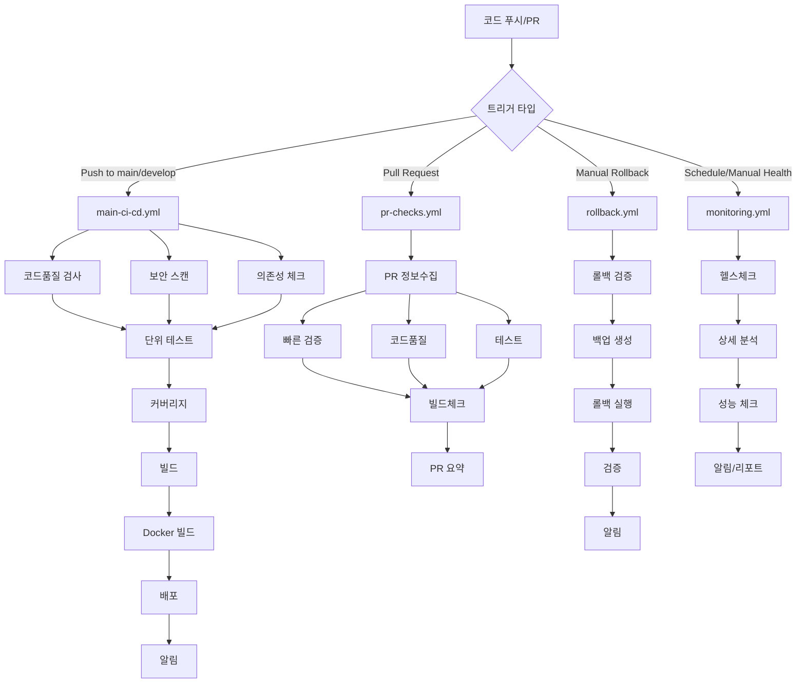

# 🔄 GitHub Actions Workflow 구조 가이드

## 📋 목차

1. [워크플로우 개요](#-워크플로우-개요)
2. [메인 CI/CD 파이프라인](#-메인-cicd-파이프라인)
3. [Pull Request 검증](#-pull-request-검증)
4. [긴급 롤백 시스템](#-긴급-롤백-시스템)
5. [헬스 모니터링](#-헬스-모니터링)
6. [사용 가이드](#-사용-가이드)
7. [트러블슈팅](#-트러블슈팅)

## 🎯 워크플로우 개요

### 🏗️ Multi-Job 아키텍처 장점

✅ **병렬 처리**: 독립적인 작업들이 동시 실행  
✅ **실패 격리**: 한 job 실패가 다른 job에 영향 없음  
✅ **재사용성**: 각 job을 다른 workflow에서 재사용 가능  
✅ **가시성**: 각 단계별 진행상황 명확히 파악  
✅ **유지보수**: 개별 job 단위로 수정 가능  
✅ **비용 효율**: 필요한 job만 실행 가능  

### 📊 워크플로우 맵



## 🚀 메인 CI/CD 파이프라인

### 📁 파일: `.github/workflows/main-ci-cd.yml`

### 🎯 트리거 조건
- **Push**: `main`, `develop` 브랜치
- **Pull Request**: `main`, `develop` 브랜치 대상
- **Manual**: 환경 선택 가능 (`staging`, `production`)

### 🔄 Job 실행 순서

#### 1단계: 코드 품질 검사 (병렬 실행)
```yaml
🔍 code-quality     ⎤
🛡️ security-scan    ⎥ 병렬 실행 (약 10-15분)
📦 dependency-check ⎦
```

#### 2단계: 테스트 실행 (순차 실행)
```yaml
🧪 unit-tests       → 📊 coverage-report
```

#### 3단계: 빌드 & 도커화 (순차 실행)
```yaml
🏗️ build           → 🐳 docker-build
```

#### 4단계: 배포 (조건부 실행)
```yaml
🚀 deploy-staging   (develop 브랜치)
🚀 deploy-production (main 브랜치)
```

#### 5단계: 알림 (결과 통보)
```yaml
✅ notify-success   (성공 시)
❌ notify-failure   (실패 시)
🧹 cleanup         (항상 실행)
```

### 🎛️ 환경별 배포 전략

| 환경 | 트리거 | 조건 | 자동/수동 |
|------|--------|------|-----------|
| **Staging** | develop 푸시 | 테스트 통과 | 자동 |
| **Production** | main 푸시 | 테스트 통과 | 자동 |
| **Manual Deploy** | workflow_dispatch | 환경 선택 | 수동 |

## 🔍 Pull Request 검증

### 📁 파일: `.github/workflows/pr-checks.yml`

### 🎯 목적
- PR 품질 자동 검증
- 개발자 피드백 제공
- 코드 리뷰 효율성 향상

### 🔄 검사 항목

#### ⚡ 빠른 검증
```yaml
✅ PR 제목 형식 (Conventional Commits)
✅ 브랜치 명명 규칙
⚠️ 커밋 메시지 검사
```

#### 🔬 상세 검증
```yaml
🔍 코드 품질 검사
🧪 테스트 실행 (변경된 Java/Gradle 파일)
🏗️ 빌드 검증
🐳 Docker 빌드 (Docker 파일 변경 시)
```

#### 📝 자동 리포트
- PR 코멘트에 자동 요약 생성
- 각 검사 결과 시각화
- 실패 시 상세 에러 정보 제공

### 📊 PR 요약 예시
```markdown
## 🔍 PR Quality Check Results

**PR #123**: feat(auth): add JWT refresh token functionality
**Author**: @developer
**Branch**: `feature/jwt-refresh` → `develop`

### 📊 Check Results
✅ **Quick Checks**: success
✅ **Code Quality**: success  
✅ **Tests**: success
✅ **Build Check**: success
⏭️ **Docker Check**: skipped

### 📈 Additional Information
- **Changed files**: src/main/java/auth/**, src/test/java/auth/**
- **Workflow run**: [View details](...)
```

## 🔄 긴급 롤백 시스템

### 📁 파일: `.github/workflows/rollback.yml`

### 🚨 사용 시나리오
- 운영 환경 장애 발생
- 새 버전 배포 후 심각한 문제 발견
- 긴급 이전 버전 복구 필요

### 🛡️ 안전 장치

#### 🔒 확인 절차
```yaml
1. 환경 선택 (staging/production)
2. 롤백 버전 지정 (previous/latest-stable/v1.2.3)
3. 롤백 사유 입력 (필수)
4. "CONFIRM" 입력으로 최종 확인
```

#### 💾 백업 시스템
```yaml
📋 현재 컨테이너 정보 백업
🖼️ 현재 Docker 이미지 백업
⚙️ 환경 설정 파일 백업
📝 배포 상태 기록
```

### 🔄 롤백 프로세스

#### 1단계: 검증 및 백업
```yaml
🔍 validate-rollback  # 요청 검증
💾 pre-rollback-backup # 현재 상태 백업
```

#### 2단계: 롤백 실행
```yaml
🔄 rollback-production # 프로덕션 롤백
```

#### 3단계: 검증 및 알림
```yaml
✅ post-rollback-verification # 롤백 후 검증
📢 notify-rollback           # 결과 알림
```

### 📞 알림 시스템
- **성공**: `#critical-alerts` 채널에 성공 메시지
- **실패**: `#critical-alerts` 채널에 긴급 알림 + GitHub Issue 자동 생성

## 📊 헬스 모니터링

### 📁 파일: `.github/workflows/monitoring.yml`

### ⏰ 스케줄
- **기본 헬스체크**: 매 30분
- **일일 리포트**: 매일 오전 9시
- **상세 검사**: 수동 트리거

### 🏥 모니터링 항목

#### 기본 헬스체크
```yaml
🌐 API 응답성 (/actuator/health)
🔗 기본 연결성 테스트
📊 응답 시간 측정
🗄️ 데이터베이스 상태
🔴 Redis 연결 상태
```

#### 상세 시스템 분석
```yaml
📈 시스템 메트릭 수집
🧠 메모리 사용률 분석
💾 디스크 사용량 체크
📱 애플리케이션 정보 수집
⚙️ 환경 설정 검증
```

#### 성능 테스트
```yaml
⏱️ 응답 시간 테스트
🔄 경량 부하 테스트
📊 주요 엔드포인트 성능 측정
```

### 🚨 알림 시스템

#### 장애 알림
```yaml
조건: Production/Staging 상태가 DOWN
채널: #alerts
즉시: Slack 알림 발송
내용: 상태, 시간, 액션 가이드
```

#### 일일 리포트
```yaml
조건: 매일 오전 9시
채널: #daily-reports  
내용: 전체 시스템 상태 요약
```

## 📖 사용 가이드

### 🚀 일반적인 개발 플로우

#### 1. 기능 개발
```bash
# 1. 기능 브랜치 생성
git checkout -b feature/awesome-feature

# 2. 개발 및 커밋
git commit -m "feat(auth): add JWT refresh functionality"

# 3. 푸시
git push origin feature/awesome-feature

# 4. PR 생성 → 자동으로 pr-checks.yml 실행
```

#### 2. 코드 리뷰 및 머지
```bash
# PR 검증 완료 후 develop으로 머지
# → 자동으로 main-ci-cd.yml 실행 (staging 배포)
```

#### 3. 운영 배포
```bash
# develop → main 머지
# → 자동으로 main-ci-cd.yml 실행 (production 배포)
```

### 🚨 긴급 상황 대응

#### 즉시 롤백이 필요한 경우
1. **GitHub Actions** → **rollback** workflow 실행
2. **환경 선택**: `production`
3. **버전 지정**: `previous` (또는 구체적 버전)
4. **사유 입력**: "Critical bug in payment system"
5. **확인 입력**: `CONFIRM`
6. **실행** → 약 5-10분 내 롤백 완료

#### 빠른 수정 배포가 필요한 경우
1. **GitHub Actions** → **deploy** workflow 실행
2. **Force Deploy**: `true` (테스트 스킵)
3. **실행** → 약 10-15분 내 배포 완료

### 🔧 수동 워크플로우 트리거

#### 환경별 수동 배포
```yaml
Workflow: main-ci-cd.yml
Trigger: workflow_dispatch
Options:
  - environment: staging/production
  - skip_tests: true/false
```

#### 헬스체크 실행
```yaml
Workflow: monitoring.yml  
Trigger: workflow_dispatch
Options:
  - check_type: basic/detailed/performance
  - environment: production/staging/all
```

## 🛠️ 트러블슈팅

### 🔍 일반적인 문제 해결

#### 테스트 실패
```yaml
문제: unit-tests job 실패
해결: 
  1. 로컬에서 테스트 실행: ./gradlew test
  2. 실패한 테스트 수정
  3. 재푸시하여 workflow 재실행
```

#### 빌드 실패
```yaml
문제: build job 실패
해결:
  1. 의존성 문제: ./gradlew dependencies 확인
  2. 컴파일 에러: 로컬 빌드로 문제 파악
  3. 환경 변수: Secrets 설정 확인
```

#### 배포 실패
```yaml
문제: deploy-production job 실패
해결:
  1. EC2 연결 확인: SSH 키, 호스트 정보
  2. Docker 이미지 확인: Registry 권한
  3. 환경 변수 확인: .env.prod 파일
  4. 수동 롤백 고려
```

#### 롤백 실패
```yaml
문제: rollback job 실패
긴급 대응:
  1. EC2에 직접 SSH 접속
  2. 수동으로 이전 컨테이너 실행
  3. Slack #critical-alerts에 상황 보고
  4. 개발팀 긴급 소집
```

### 📞 에스컬레이션 가이드

#### Level 1: 자동 해결
- GitHub Actions 자동 재시도
- Slack 알림을 통한 상황 인지

#### Level 2: 개발자 개입
- 워크플로우 수동 재실행
- 간단한 설정 수정
- 테스트/빌드 문제 해결

#### Level 3: 긴급 대응
- 수동 롤백 실행
- 인프라 팀 연락
- 고객 대응팀 알림

#### Level 4: 전체 시스템 점검
- 서비스 일시 중단
- 전체 팀 소집
- 근본 원인 분석

### 🔍 로그 및 디버깅

#### GitHub Actions 로그 확인
```
1. GitHub Repository → Actions 탭
2. 해당 Workflow 실행 클릭
3. 실패한 Job 클릭
4. 상세 로그 확인
```

#### 애플리케이션 로그 확인
```bash
# EC2 서버 접속
ssh user@server

# 컨테이너 로그 확인
docker logs autocoin-api-prod --tail 100 -f

# 파일 로그 확인
tail -f /opt/autocoin/logs/autocoin.log
```

#### 시스템 상태 확인
```bash
# 헬스체크
curl https://api.autocoin.com/actuator/health

# 컨테이너 상태
docker ps | grep autocoin

# 시스템 리소스
docker stats autocoin-api-prod
```

---

## 📞 추가 지원

### 🆘 긴급 연락처
- **Slack**: #critical-alerts (즉시 대응)
- **GitHub**: Issues 생성 (비긴급)
- **Email**: DevOps 팀

### 📚 참고 문서
- [GitHub Actions 공식 문서](https://docs.github.com/en/actions)
- [Spring Boot Actuator](https://docs.spring.io/spring-boot/docs/current/reference/html/actuator.html)
- [Docker 운영 가이드](https://docs.docker.com/)

---

**🚀 Happy Deploying!**  
*Autocoin DevOps Team*
